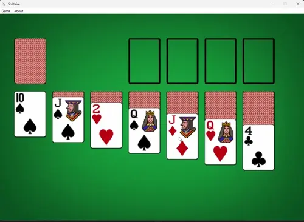

# Solitaire



Solitaire-clone made with OpenGL. Resources (backgrounds and app icon) are inspired by Windows 7 Solitaire.


This game loads resources from DLL.

## Features

* Customizable background

* Sound effects for cards

* Cursor changes whether move is legal or not

* Save/load progress

* Hotkeys

    * CTRL-S / CTRL-L - Save/Load

    * CTRL-N - New game

    * CTRL-Z - Undo

* Undo move

* Simplistic win animation

* Game timer (with pause/resume feature)

## Dependencies

* GLFW3 and GLFW3 Native

* GLAD

* stb_image

### Additional notes

You need to compile DLL from resoucred in ```res``` folder.